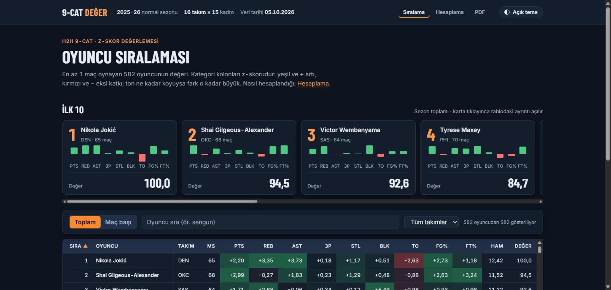
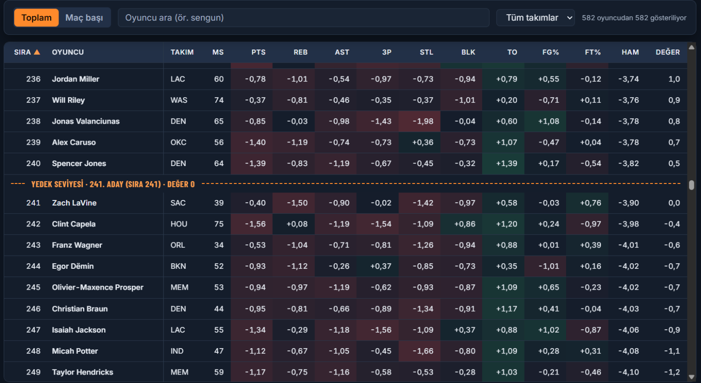
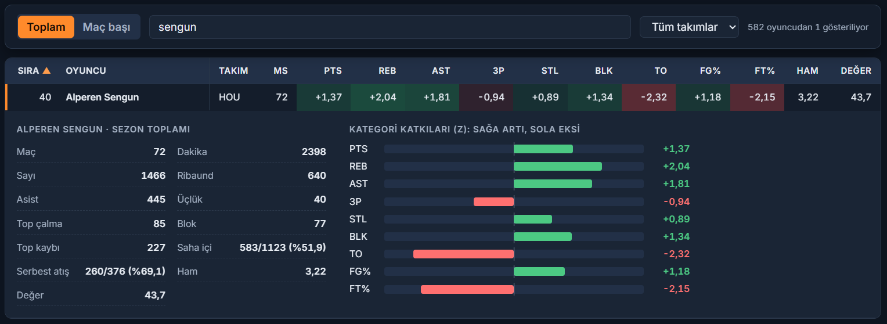
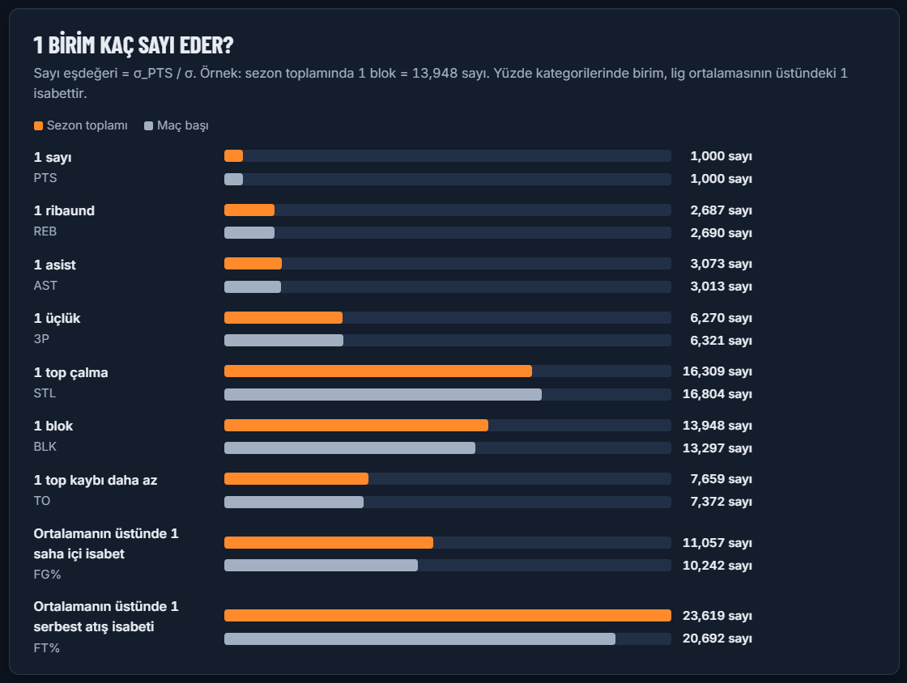
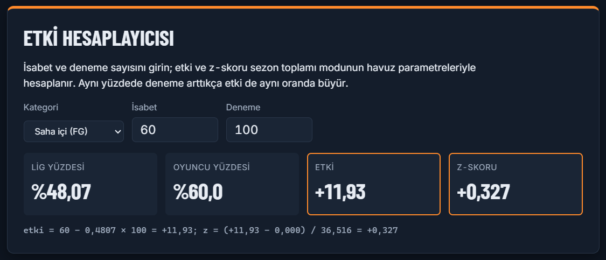
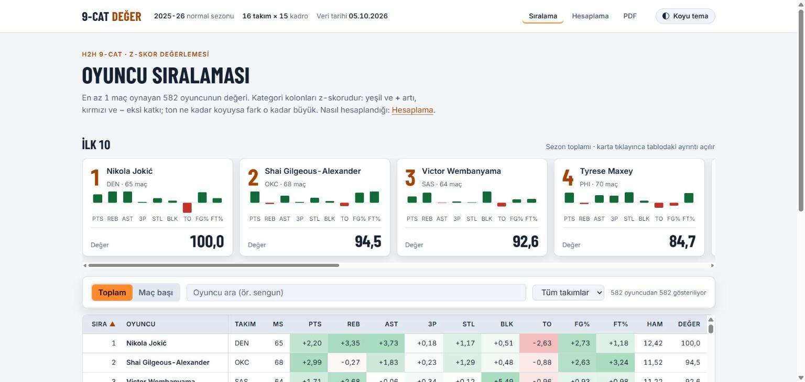
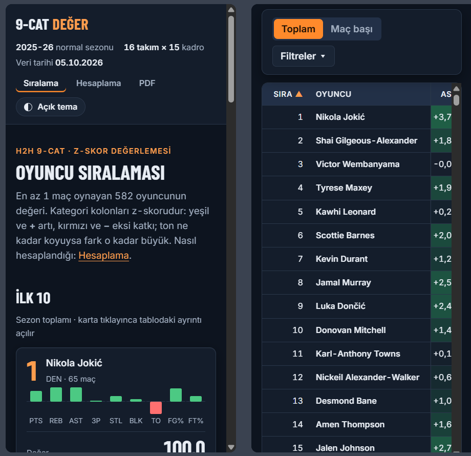

# fantasy9cat — Fantezi NBA 9-Cat Oyuncu Değerleme

**Bir blok kaç sayı eder? 60/100 şut, 6/10'dan ne kadar daha değerli?** Bu proje, 2025-26 NBA
normal sezonu verisinden her oyuncunun **16 takım × 15 kadroluk H2H 9-cat** ligdeki değerini tek
bir sayıya indirir ve o sayının nereden geldiğini adım adım gösterir.



## Neden?

9-cat ligde her hafta dokuz kategorinin her biri ayrı kazanılır ve hepsi eşit puan verir. Ama
istatistikler eşit nadirlikte değildir: oyuncular arasındaki blok farkı sayı farkından çok daha
küçüktür, bu yüzden bir blok farkı kategoriyi kazanmaya çok daha fazla katkı yapar. Yüzdelerde de
hacim önemlidir: %60 isabetle 60/100 atan oyuncu takımın haftalık yüzdesini, aynı yüzdeyle 6/10
atandan on kat daha fazla etkiler.

fantasy9cat bu iki etkiyi z-skorla ölçer ve sonucu **0–100 ölçeğinde tek bir değer** olarak verir.
Bu sezonun verisinde:

- **1 blok ≈ 13,9 sayı**, **1 top çalma ≈ 16,3 sayı**, **1 üçlük ≈ 6,3 sayı** değerindedir.
- 1. sırada **Nikola Jokić** (değer 100,0); **Alperen Sengun** 40. sırada (43,7).
- Ligdeki 240 kadro yerine giremeyen ilk oyuncu, yani yedek seviyesi, 241. sırada değer 0'dır.

## Nasıl hesaplanır?

| Kategori | Formül | Not |
|---|---|---|
| Sayı, ribaund, asist, üçlük, top çalma, blok | `z = (x − μ) / σ` | Çok olan kazanır |
| Top kaybı | `z = (μ − x) / σ` | Az olan kazanır; işaret ters |
| Saha içi %, serbest atış % | `etki = isabet − lig% × deneme`, `z = (etki − μ) / σ` | Yüzde değil, hacimli etki z'lenir |

- **Ham değer** 9 z-skorun toplamıdır. **Değer** = 100 × (ham − ham₂₄₁) / (ham₁ − ham₂₄₁); 1. aday
  100, yedek seviyesi 0, altındakiler eksi alır.
- **μ ve σ** tüm oyunculardan değil, **en değerli 240 oyuncudan** (16 × 15) oluşan havuzdan
  hesaplanır. Havuz dakikaya göre başlar, ham değere göre ilk 240 değişmeyene kadar (en fazla 10
  kez) yenilenir. Yine de sezonda en az 1 maç oynayan **herkes** (582 oyuncu) değerlenir.
- İki sıralama vardır: **sezon toplamı** (ana sıralama; çok maç oynamak katkıdır) ve **maç başı**
  (20 maçtan az oynayanlar "az maç" olarak işaretlenir ve havuza giremez).

Her sayının çalışılmış örnekle açıklaması `output/Hesaplama.md`'de ve sitedeki "Hesaplama"
sayfasındadır. Formüllerin bağlayıcı tanımı: [ISKELET.md §3.3](ISKELET.md).

## Web sitesi

`python -m fantasy9cat all` sonrası `output/site/index.html` dosyasına **çift tıklamanız** yeterli:
sunucu, internet ya da harici kütüphane gerekmez; veriler sayfaya gömülüdür.

**Yedek seviyesi çizgisi.** Tablo, kategori katkılarını ısı haritası olarak gösterir: yeşil ve `+`
artı, kırmızı ve `−` eksi; ton ne kadar koyuysa fark o kadar büyüktür (renk körlüğü için işaret
ve yoğunluk da kullanılır). Turuncu kesik çizgi, 240 kadro yerinin bittiği yeri gösterir.



**Oyuncu ayrıntısı.** Bir satıra ya da ilk 10 kartına tıklayınca ham istatistikler ve dokuz
kategorinin artı/eksi yönlü katkı çubukları açılır. Arama aksan ve büyük/küçük harf duyarsızdır:
`sengun`, `şengün` ve `SENGÜN` aynı oyuncuyu bulur.



**Hesaplama sayfası.** Yöntem, Hesaplama.md ile aynı 11 bölüm ve aynı sayılarla anlatılır. Çarpan
tablosu "1 birim kaç sayı eder?" grafiğiyle görselleştirilir ve etki hesaplayıcısında kendi
isabet/deneme sayılarınızı deneyebilirsiniz.

| Sayı eşdeğeri grafiği | Etki hesaplayıcısı |
|---|---|
|  |  |

**Açık tema ve mobil.** Tema sistem tercihine göre seçilir, sağ üstteki düğmeyle değiştirilir.
360 px genişlikte kartlar tek sütuna iner, kontrol çubuğu katlanır, tablo yatay kayarken sıra ve
oyuncu kolonları sabit kalır.

| Açık tema | Mobil (360 px) |
|---|---|
|  |  |

`output/site/` yalnızca göreli yollar kullanır ve sunucu kodu içermez; klasör olduğu gibi herhangi
bir statik barındırma servisine yüklenebilir. Üst menüdeki "PDF" bağlantısı `../Deger.pdf`'i
gösterir; yayında da çalışması için `Deger.pdf`'i sitenin bir üst klasörüne koyun.

## Çıktılar

| Dosya | İçerik |
|---|---|
| `data/processed/values_total.csv` | Sezon toplamı sıralaması: 9 z-skor, ham değer, 0–100 değer, sıra |
| `data/processed/values_per_game.csv` | Maç başı sıralaması (GP < 20 olanlar `low_sample`) |
| `data/processed/multipliers.csv` | Her mod için μ, σ, çarpan (1/σ), sayı eşdeğeri |
| `data/processed/meta.json` | Havuz iterasyonu, yedek seviyesi, kaynak dosyanın SHA-256'sı, uyarılar |
| `output/Hesaplama.md` | Yöntem, çarpan tablosu ve çalışılmış örnek (11 bölüm) |
| `output/Deger.pdf` | A4 yatay: yöntem özeti ve iki sıralama tablosu (renkli z hücreleri) |
| `output/site/` | Yukarıdaki statik web sitesi |

Ham ve işlenmiş veri git'e eklenir; `output/` eklenmez, her an yeniden üretilebilir. Aynı ham CSV
her zaman byte-düzeyinde aynı çıktıları üretir (zaman damgası yok).

## Kurulum

Gerekenler: Python ≥ 3.11 ve pip.

```bash
git clone <depo-adresi> fantasy-9cat
cd fantasy-9cat
python -m venv .venv
source .venv/bin/activate          # Windows (PowerShell): .venv\Scripts\Activate.ps1
                                   # Windows (cmd):        .venv\Scripts\activate.bat
pip install -e ".[dev]"
python -m fantasy9cat all          # birkaç saniye; ham veri depoda olduğu için ağa çıkmaz
```

## Komutlar

Her adım yalnızca bir önceki adımın dosyalarını okur; adımlar ayrı ayrı da çalıştırılabilir. Tüm
komutlar `--season` alır (varsayılan `2025-26`).

```bash
python -m fantasy9cat fetch        # stats.nba.com → data/raw/
python -m fantasy9cat compute      # data/raw/ → data/processed/
python -m fantasy9cat report       # data/processed/ → output/Hesaplama.md, output/Deger.pdf
python -m fantasy9cat site         # → output/site/ (compute ve report çıktıları yoksa çalışmaz)
python -m fantasy9cat all          # (ham veri yoksa fetch) → compute → report → site
```

Çıkış kodları: `0` başarılı, `1` hata (Türkçe mesaj stderr'e yazılır).

- `fetch` mevcut ham CSV'nin üzerine yazmaz; yeniden çekmek için dosyayı önce elle kaldırın.
- `site`, işlenmiş dosyalar ile `Hesaplama.md` ve `Deger.pdf` yoksa eksikleri listeler ve durur.

## stats.nba.com erişilemezse: elle CSV

stats.nba.com bazı ağları (özellikle bulut IP'lerini) engeller. `fetch` 3 denemeden sonra Türkçe
hata mesajıyla çıkar. Bu durumda ham dosyayı elle hazırlayıp
`data/raw/players_2025-26_regular.csv` adıyla koyun. Dosya şu şemaya uymalıdır (ISKELET.md §3.4):

| Kolon | Tip | Açıklama |
|---|---|---|
| `PLAYER_ID` | tamsayı | NBA oyuncu kimliği |
| `PLAYER_NAME` | metin | Oyuncu adı (API'deki haliyle) |
| `TEAM_ABBREVIATION` | metin | Son takımı (takım değiştiren oyuncu tek satır) |
| `GP, MIN, FGM, FGA, FG3M, FTM, FTA, REB, AST, STL, BLK, TOV, PTS` | sayı ≥ 0 | Sezon **toplamları** (maç başı değil) |

- Kaynak: nba.com/stats → Players → Traditional Stats; Season `2025-26`, Season Type
  `Regular Season`, Per Mode `Totals`.
- UTF-8, virgülle ayrılmış, ondalık ayırıcı nokta, başlık satırı yukarıdaki kolon adlarıyla.
- Kurallar: en az 400 satır; boş/negatif değer yok; `FGM ≤ FGA`, `FTM ≤ FTA`, `FG3M ≤ FGM`.
  `GP > 82` yalnızca uyarı verir.

Dosyayı denetlemek için:

```bash
python -c "import pandas as pd; from fantasy9cat.schema import validate; validate(pd.read_csv('data/raw/players_2025-26_regular.csv')); print('geçerli')"
```

## Proje yapısı

```
src/fantasy9cat/
  fetch.py, schema.py     veri çekme (nba_api) ve doğrulama
  valuation.py            z-skor, etki, iteratif havuz, ölçek (saf fonksiyonlar)
  pipeline.py             compute adımı → data/processed/
  context.py              rapor, PDF ve site için tek veri bağlamı
  report_md.py, report_pdf.py, site.py
templates/                hesaplama.md.j2 ve site şablonları (HTML, CSS, JS, favicon)
assets/                   fontlar (DejaVu, Inter, Barlow Condensed) ve README görselleri
data/raw/, data/processed/
tests/                    ağa çıkmayan testler; sentetik fikstür (500 oyuncu, seed=42)
```

Kapsam, formüller ve kabul kriterleri [ISKELET.md](ISKELET.md)'de; kod kuralları
[CLAUDE.md](CLAUDE.md)'de; geliştirme süreci [AGENT.md](AGENT.md)'de.

## Geliştirme

```bash
pytest -q                          # testler ağa çıkmaz; nba_api mock'lanır
ruff check .
ruff format --check .              # düzeltmek için: ruff format .
```

- Testler `tests/fixtures/sample_players.csv` sentetik verisini kullanır. Yeniden üretmek için:
  `python tests/fixtures/make_sample_players.py` (elle düzenlemeyin).
- Site etkileşimleri (arama, sıralama, filtre, ayrıntı satırı, mobil görünüm) ISKELET.md F11'deki
  elle kontrol listesiyle doğrulanır.

## Sorun giderme

- **Windows konsolunda bazı harfler `?` görünüyor** (ör. `Jokić`): konsol kod sayfası bu harfleri
  basamaz; dosyalardaki veriler etkilenmez. İsterseniz `chcp 65001` ile konsolu UTF-8'e alın.
- **`site` "eksik dosya" diyor**: önce `compute` ve `report` çalıştırın (veya doğrudan `all`).
- **`site` "yazılamadı" diyor**: `output/site/` içindeki bir dosya başka bir programda açık
  olabilir; kapatıp yeniden deneyin.
- **`fetch` "zaten var" diyor**: ham veri korunur; yeniden çekmek için dosyayı elle silin.

## Lisanslar

Fontlar `assets/fonts/` altındadır ve kendi lisanslarıyla dağıtılır:

- DejaVu Sans (PDF'e gömülür): [assets/fonts/LICENSE](assets/fonts/LICENSE)
- Inter ve Barlow Condensed (sitede yerel woff2, SIL Open Font License 1.1):
  [assets/fonts/OFL-Inter.txt](assets/fonts/OFL-Inter.txt),
  [assets/fonts/OFL-Barlow.txt](assets/fonts/OFL-Barlow.txt)

Veri kaynağı stats.nba.com'dur (`nba_api`).
